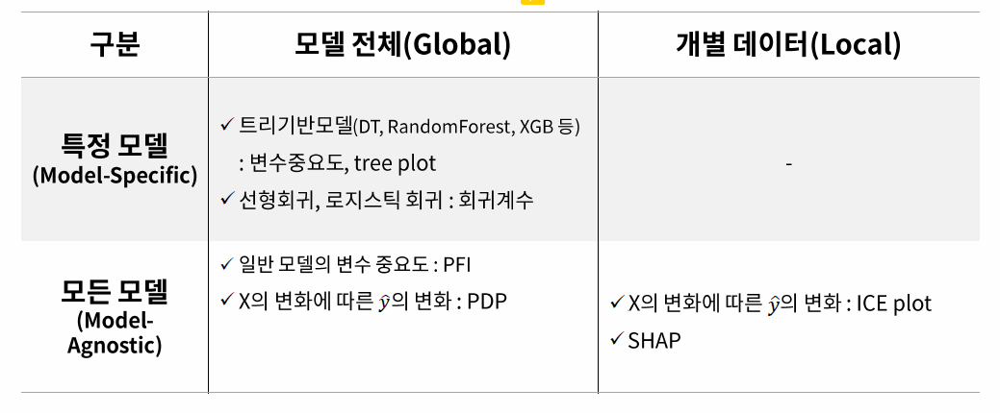

# 모델 해석 방식 분류

**1. 트리 모델 변수 중요도**
   
[링크](https://github.com/Woojin-02/Today-I-Learn/blob/main/AI%20%EB%AA%A8%EB%8D%B8%20%ED%95%B4%EC%84%9D%20%ED%8F%89%EA%B0%80/1.%20%ED%8A%B8%EB%A6%AC%EA%B8%B0%EB%B0%98%20%EB%AA%A8%EB%8D%B8%20%EB%B3%80%EC%88%98%20%EC%A4%91%EC%9A%94%EB%8F%84.md)

**2. 일반 모델 변수 중요도**

[링크](https://github.com/Woojin-02/Today-I-Learn/blob/main/AI%20%EB%AA%A8%EB%8D%B8%20%ED%95%B4%EC%84%9D%20%ED%8F%89%EA%B0%80/2.%20%EC%9D%BC%EB%B0%98%20%EB%AA%A8%EB%8D%B8%20%EB%B3%80%EC%88%98%20%EC%A4%91%EC%9A%94%EB%8F%84.md)

**3. 일반 모델 변수 중요도**

**4. Feature에 따른 예측값 변화**

**5. SHAP**

