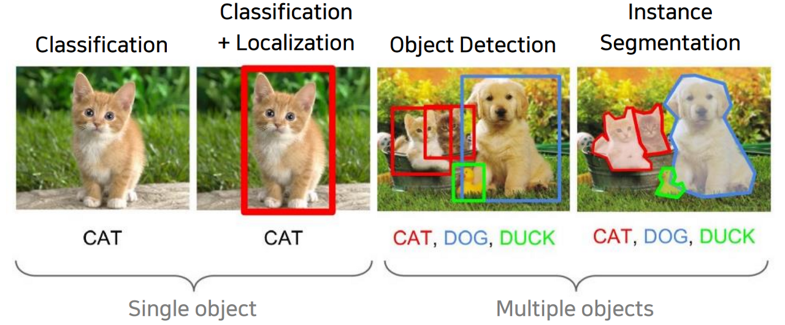
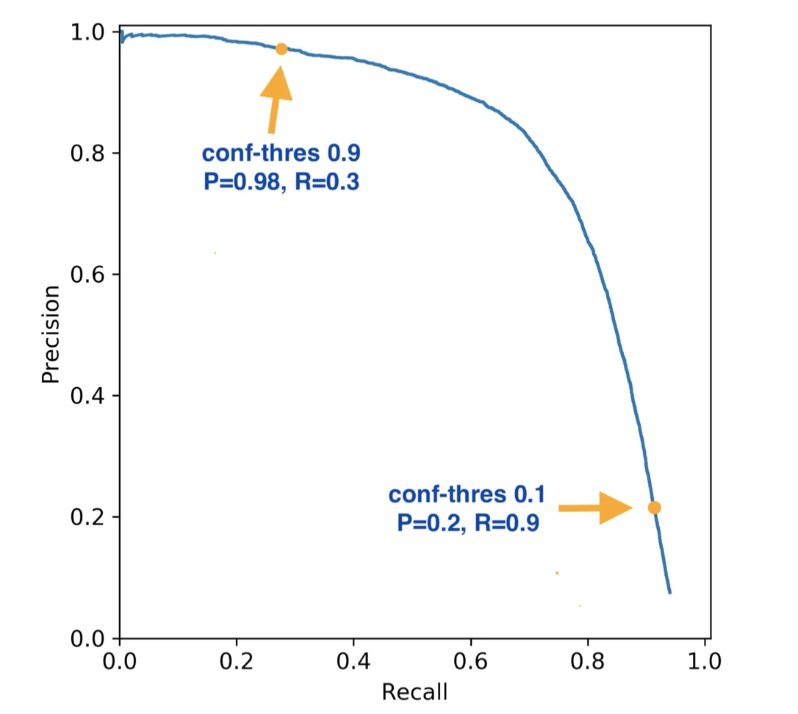

# Object Detection

### Object Detection이란?

* Multi-Labeled Classification + Bounding Box Regression
    * Multi-Labeled Classification(다중 레이블 분류) : 각 샘플이 여러 개의 클래스에 속할 수 있는 분류 문제
    * Bounding Box Regression
* 즉, 다수의 사물이 존재하는 상황에서 각 사물의 위치와 클래스를 찾는 작업

### Object Detection 주요 개념

* 정답 박스 : Ground-truth Bounding Box
* 예측 박스 : Prediction Bounding Box

#### 1. **Bounding Box**
* 하나의 Object가 포함된 최소 크기 박스
* 다양한 표현 방법이 있지만, 여기서는 x, y(좌표), w, h(크기)라고 표현함
* x, y, w, h, 즉 위치정보로 구성되어있음
* 정답박스와 예측박스가 있음
    * 만약 정답박스의 x, y와 예측박스의 x, y 값이 서로 비슷할수록 *꼭짓점을* 잘 예측한 것
    * 만약 정답박스의 w, h와 예측박스의 w, h 값이 서로 비슷할수록 *크기를* 잘 예측한 것

#### 2. **Class Classifcation**
* Bounding Box 안에 있는 이미지가 어떤 것인지 분류하는것

#### 3. **Confidence Score**
* Object가 Bounding Box 안에 있는지에 대한 *확신의 정도*
* 0 ~ 1 사이의 값
* 1에 가까울 수록 박스 안에 object가 있다고 판단함
* 0에 가까울 수록 박스 안에 object가 없다고 판단함
* 다만 Confidence Score 값은 0.95 처럼 일에 가깝더라도, 박스 안에 object가 없을 수 있음
* 아래 세가지로 계산함
    1. 단순히 Object가 있을 확률
    2. Object가 있을 확률 X IoU
    3. Object가 특정 클래스일 확률 X IoU

#### 4. IoU(Intersection over Union)
* 두 박스의 중복 영역 크기를 통해 측정하며, 겹치는 영역이 넓을수록 좋은 예측임
* 두 영역의 `교집합 / 합집합`으로 구함
* 0 ~ 1 사이의 값이 나옴
* 값이 클수록 좋은 예측임

#### 5. NMS(Non-Maximum Suppression)
* 동일 Object에 대한 중복 박스 제거
* 실제 정답과 예측 박스의 IoU값들끼리 비교해서 일정값 이상이면 같은 Object를 가리킨다고 판단하고
* 상대적으로 Confidence Score가 낮은 Bounding Box 제거
* Confidence Score Threshold가 높을수록, IoU Threshold가 낮을수록, 박스에 대한 중복 판단이 깐깐해짐
    * confidence score thread는 오브젝트가 있을 확신의 정도이기 때문에, 오브젝트가 있다고 서로 확신을 할수록, 그리고 오브젝트가 겹쳐있다고 판단하는 값(IoU)이 높을수록 중복 판단을 내리는 데에 엄격하고 깐깐해짐
* 알고리즘은 아래와 같다.
```
1. 일정 Confidence Score 이하의 Bounding Box 제거
2. 남은 Bounding Box들을 Confidence Score 내림차순으로 정렬
3. 첫 Bounding Box와의 IoU 값이 일정 이상인박스들을 제거
    이때 첫 Bounding Box는 Confidence Score가 가장 높은 Box로 결정
4. Bounding Box가 하나 될 때까지 반복
```

#### 6. Precision, Recall, AP, **mAP**
1. Precision
* TP / (TP + FP)
* 모델이 Object라 예측한 것 중 실제 Object의 비율

2. Recall
* TP / (TP + FN)
* 실제 Object 중 모델이 예측하여 맞춘 Object의 비율

```
IoU Threshold 값에 따라 Precision, Recall 변화함
 -> IoU Threshold 값을 올리면 TP에 대한 기준 깐깐해지면서, Precision은 좋아지지만 Recall은 나빠짐
 -> IoU Threshold 값을 내리면 TP에 대한 기준 느슨해지면서, Recall은 좋아지지만 Precision은 나빠짐
```

3. Precision - Recall Curve
* Precision과 Recall을 모두 감안한 지표


4. AP(Average Precision)
* Precision - Recall Curve 그래프 아래의 면적

5. **mAP(mean Average Precision)**
* 각 클래스 별 AP를 합산하여 평균을 낸 것
* 가장 많이 사용하는 지표
* (검토 필요)
    * pascal : IoU threshold 0.5로 설정
    * ms CoCo :IoU threshold 0.5 ~ 0.95까지 점점 값을 올리면서 mAP 계산함

#### 7. Annotation
* 이미지 내 Detection 정보를 별도의 설명 파일로 제공되는 것
* Object의 Bounding Box 위치나 Object 이름 등을 특정 포맷으로 제공

