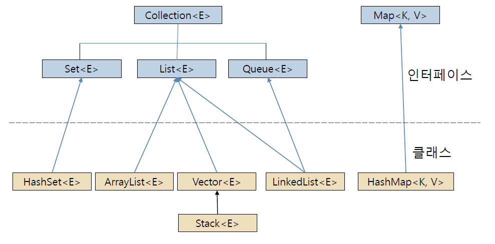

# Java Collection

### 1. 컬렉션

**1. 개념**
* 요소라고 불리는 가변 개수의 객체들의 저장소
    * = 객체들의 컨테니어
* 요소의 삽입, 삭제에 따른 요소의 위치 자동 이동
* 요소의 개수에 따라 크기 자동 조절

**2. 장점**
* 고정 크기의 배열을 다루는 어려움 해소
* 다양한 객체들의 삽입, 삭제, 검색 등 관리 용이

**3. 특징**
* 제네릭(Generics) 기법으로 구현
    * 특정 타입만 다루지 않고 여러 종류의 타입으로 변신할 수 있도록 클래스나 메소드를 일반화시키는 기법
    * `<E>, <K>, <V>` 등 타입매개변수
    * 일반화된 형판을 만드는 기법

* 컬렉션의 요소는 객체만 가능
    * int, char, double 등의 기본 타입으로 구체화 불가

### 2. 인터페이스와 클래스

### 3. Stack<E>
