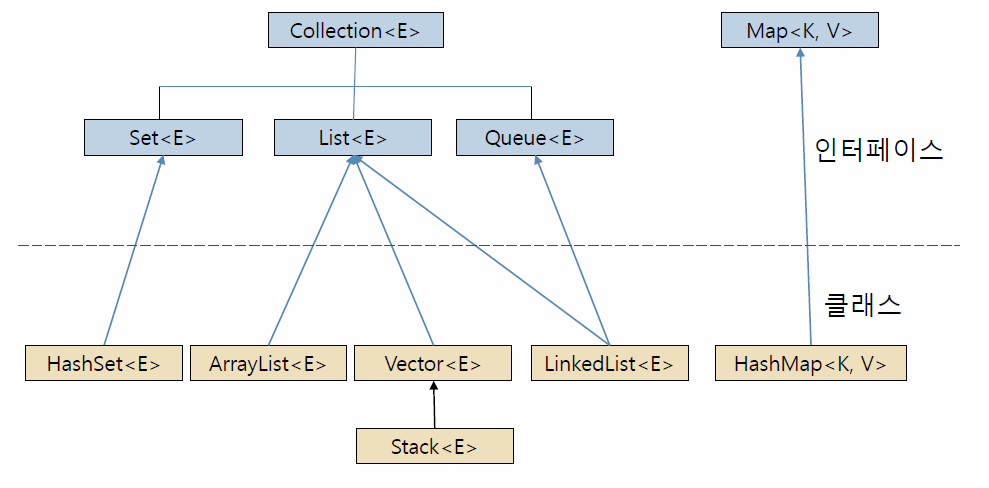

# Java Collection

### 1. 컬렉션

**1. 개념**
* 요소라고 불리는 가변 개수의 객체들의 저장소
    * = 객체들의 컨테니어
* 요소의 삽입, 삭제에 따른 요소의 위치 자동 이동
* 요소의 개수에 따라 크기 자동 조절

**2. 장점**
* 고정 크기의 배열을 다루는 어려움 해소
* 다양한 객체들의 삽입, 삭제, 검색 등 관리 용이

**3. 특징**
* 제네릭(Generics) 기법으로 구현
    * 특정 타입만 다루지 않고 여러 종류의 타입으로 변신할 수 있도록 클래스나 메소드를 일반화시키는 기법
    * `<E>, <K>, <V>` 등 타입매개변수
    * 일반화된 형판을 만드는 기법

* 컬렉션의 요소는 객체만 가능
    * int, char, double 등의 기본 타입으로 구체화 불가

### 2. 인터페이스와 클래스

### 3. `Vector<E>`

**1. 특징**
* `<E>` 에 사용할 요소의 특정 타입으로 구체화
* 배열을 가변 크기로 다룰 수 있게 하는 컨테이너
* 요소 객체들을 삽입 삭제 검색하는 컨테이너
* Vector에는 객체, null 삽입 가능
    * 맨 뒤, 중간에 삽입 가능 
    * 임의의 위치에 있는 객체 삭제 가능
* add() : 요소 삽입
* get() : 요소 검색
* 타입 매개 변수(Integer, String 등)을 사용하지 않으면 에러

**2. 주요 메소드**

|메소드|설명|
|------|---|
|boolean add(E element)|벡터의 맨 뒤에 element 추가|
|void add(int index, E element)|인덱스 index에 element 삽입|
|int capacity()|벡터의 현재 용량 리턴|
|boolean addAll(Collection<? extends E> c)|컬렉션 c의 모든 요소를 벡터의 맨 뒤에 추가|
|void clear()|벡터의 모든 요소 삭제|
|boolean contains(Object o)|벡터가 지정한 객체 o를 포함하고 있으면 true 리턴|
|E elementAt(int index)|인덱스 index의 요소 리턴|
|E get(int index)|인덱스 index의 요소 리턴|
|int indexOf(Object o)|o와 같은 첫번째 요소의 인덱스 리턴, 없으면 -1 리턴|
|boolean isEmpty()|벡터가 비어있으면 true 리턴|
|E remove(int index)|인덱스 index의 요소 삭제|
|boolean remove(Object o)|객체 o와 같은 첫번째 요소를 벡터에서 삭제|
|void removeAllElements|벡터의 모든 요소 삭제 후 크기 0|
|int size()|벡터가 포함하는 요소의 개수 리턴|
|Object[] toArray()|벡터의 모든 요소를 포함하는 배열 리턴|

### 4. `ArrayList<E>`

**1. 특징**
* 가변 크기 배열을 구현한 클래스
* 벡터와 거의 동일하나 스레드 동기화 기능이 없음

**2. 주요 메소드**

|메소드|설명|
|------|---|
|boolean add(E element)|ArrayList의 맨 뒤에 element 추가|
|void add(int index, E element)|인덱스 index에 element 삽입|
|boolean addAll(Collection<? extends E> c)|컬렉션 c의 모든 요소를 ArrayList의 맨 뒤에 추가|
|void clear()|ArrayList의 모든 요소 삭제|
|boolean contains(Object o)|ArrayList가 지정한 객체 o를 포함하고 있으면 true 리턴|
|E elementAt(int index)|인덱스 index의 요소 리턴|
|E get(int index)|인덱스 index의 요소 리턴|
|int indexOf(Object o)|o와 같은 첫번째 요소의 인덱스 리턴, 없으면 -1 리턴|
|boolean isEmpty()|ArrayList가 비어있으면 true 리턴|
|E remove(int index)|인덱스 index의 요소 삭제|
|boolean remove(Object o)|객체 o와 같은 첫번째 요소를 ArrayList에서 삭제|
|int size()|ArrayList가 포함하는 요소의 개수 리턴|
|Object[] toArray()|ArrayList의 모든 요소를 포함하는 배열 리턴|

### 5. `Iterator<E>`

**1. 특징**
* 컬렉션의 순차 검색을 위해 사용
* 리스트 구조의 컬렉션에서 요소의 순차 검색을 위한 인터페이스
    * Vector<E>, ArrayList <E>, LinkedList < 가 상속받음

**2. 주요 메소드**

|메소드|설명|
|------|---|
|boolean hasNext()|다음 반복에서 사용될 요소가 있으면 true 리턴|
|E next()|다음 요소 리턴|
|void remove()|마지막으로 리턴된 요소 제거|

### 6. `HashMap<K, V>`

**1. 특징**
* 키와 값의 쌍으로 구성되는 요소를 다루는 컬렉션
    * K : 키로 사용할 요소의 타입
    * V : 값으로 사용할 요소의 타입
    * 값을 검색하기 위해선 반드시 키가 필요
* 삽입 및 검색이 빠름
    * 요소 삽입 : put() 메소드
    * 요소 검색 : get() 메소드

**2. 주요 메소드**

|메소드|설명|
|------|---|
|void clear()|HashMap의 모든 요소 삭제|
|boolean containsKey(Object key)|지정된 키(key)를 포함하고 있으면 true 리턴|
|boolean containsValue(Object value)|하나 이상의 키를 지정된 값(value)에 매핑시킬 수 있으면 ture 리턴|
|V get(Object key)|지정된 키에 매핑되는 값 리턴. 어떤 값도 없으면 null 리턴|
|boolean isEmpty()|HashMap이 비어있으면 true 리턴|
|Set<K> keySet()|HashMap에 있는 모든 키를 담은 Set<K> 컬렉션 리턴|
|V put(k key, V value)|key와 value를 매핑하여 HashMap에 저장|
|V remove(Object key)|지정된 키와 이에 매핑된 값을 HashMap에서 삭제|
|int size()|ArrayList가 포함하는 요소의 개수 리턴|

