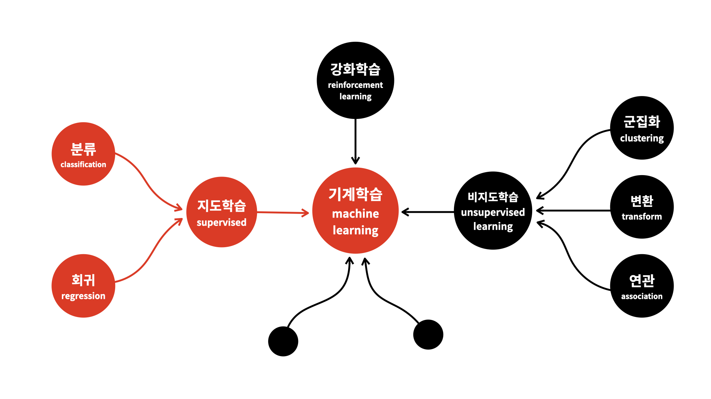

# 머신러닝이란?

* 컴퓨터를 인간처럼 학습시킴으로써 컴퓨터가 새로운 규칙을 생성할 수 있지 않을까 하는 시도에서 시작되어 컴퓨터가 스스로 학습할 수 있도록 도와주는 알고리즘이나 기술을 개발하는 분야

* 학습 방법에 따른 분류
    * 지도 학습 : 정답을 미리 제공하여 데이터의 패턴을 배우게 하는 학습 방법
    * 비지도 학습 : 정답이 없는 데이터만으로 배우게 하는 학습 방법
    * 강화 학습 : 선택한 결과에 대해 보상을 받아 행동을 개선하면서 배우게 하는 학습 방법

* 머신러닝 분류

 - 분류 : 어떤 그룹에 속하게 될 것인지를 판단
 - 회귀 : 어떤 값이 될것인지 예측
 - 군집화 : 비슷한 것들을 찾아서 그룹으로 묶음
 - 변환 : 쉽게 이해할 수 있는 형태로 데이터를 표현
 - 연관 : 서로 연관된 특징을 찾아냄