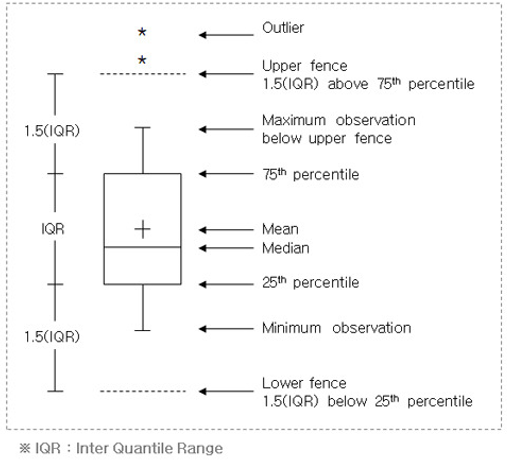

# 단변량 분석 - 숫자

## 숫자형 변수를 정리하는 방법
 1. 기초 통계량
    * 평균값 (mean)
    * 중앙값 (median)
    * 최빈값 (mode)
    * 사분위수 (Quantile)

 2. 도수분포표(frequency table)
    * 구간을 나누고 빈도수 계산

### 1. 기초통계량

* 숫자형 변수를 쉽게 파악하기 위해 숫자 몇 개로 요약

1. **df.describe()**
    * 기초통계량을 구하는 메서드

2. 평균(mean)
    * 산술평균, 기하평균, 조화평균
        * 산술평균 : 모든 값들을 더한 후, 백수로 나눈 수
        * 조화평균 : 분자가 동일한 두 비율의 평균 ( 2ab / a + b )
    * np.mean
    * .mean()
    * 평균이 항상 데이터를 대표하지 않음을 주의

3. 중위수(median)
    * 자료의 순서상 가운데 위치한 값
    * np.median
    * .median()

4. 최빈값(mode)
    * 자료 중에서 가장 빈번한 값
    * .mode()

5. 최댓값(max), 최솟값(min)
    * .max(), np.max
    * .min(), np.min

6. 표준편차(std)
    * .std(), np.std

7. 개수(count)
    * 데이터 개수
        * 다른 변수에 비해 개수가 적은 열이 있다면 NaN이 존재함

8. **사분위수**
    * 데이터를 오름차순으로 정렬한 후,
    * 전체를 4등분하고, 각 경계에 해당하는 값(25%, 50%, 75%)을 의미
        * 25% : 1사분위수
        * 50% : 2사분위수
        * 75% : 3사분위수

### 2. 도수분포표

도수분포표를 보고 데이터를 분석할 수 있어야 함
* 히스토그램을 보고 밀도함수 그래프 추측
* 박스플롯과 히스토그램, 밀도함수 그래프를 보고 비즈니스 관점으로 분석하기 등

1. Histogram(히스토그램)
```python
plt.hist(titanic.Fare, binsbins=30 ,edgecoloredgecolor=' gray')
plt.xlabel(' Fare')
plt.ylabel(' Frequency')
plt.show()
```
 * bins : 구간의 개수
    * bins 의 값이 커질수록 구간이 더 세세하게 표현된다.
    * 구간이 개수에 따라 파악할 수 있는 내용이 달라진다.
    * 작은 구간부터 시작해서 구간을 점점 늘려서 구간이 작을 때와 많을 때를 비교해야 한다.

2. Density plot(KDE, 밀도함수 그래프)
    * 구간의 너비를 정하지 않아도 됨
    * **밀도 함수 그래프 아래 면적은 '1'**
    * 면적은 구간에 대한 확률을 추정 가능하게 함 = 밀도 추정
        * 측정된 데이터로부터 전체 대이터 분포의 특성을 추정
```python
sns.kdeplot(titanic[titanic[' Fare'])
plt.show()
```

3. Box plot(박스 플롯)
 * 사전에 반드시 NaN을 제거해야함. 제거하지 않으면 동작하지 않음
    * sns.boxplot은 NaN을 알아서 제거
```python
plt.boxplot(temp['Age'] vert=False)
plt.grid()
plt.show()
```
* vert = False(횡), vert=True(종, 기본값)
* 박스 플롯 분석

