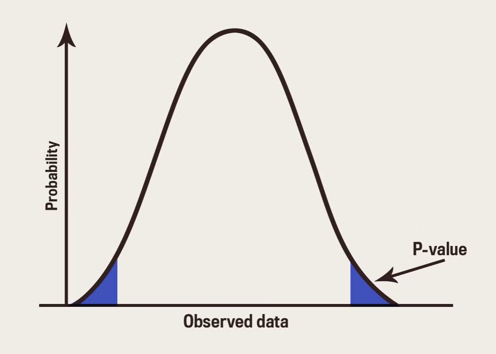

# 데이터 의미찾기 - 가설검정

#### 1. 연구 절차

    1. 기존 가설(정설, 원칙, 규칙)에 반하는 증거에 기반해 새로운 가설을 세운다.
    2. 새로운 가설을 증명할 데이터를 수집한다.
    3. 데이터를 기반으로 가설을 검정한다.
        * p-value < 0.05 라면 새로운 가설을 채택되고, 기존가설은 폐기된다
        * p-value >= 0.05 피드백을 통해 새로운 가설을 업데이트한다.

#### 2. 모집단과 표본
모집단 : 우리가 알고 싶은 대상 전체 영역(데이터) 
표본 : 그 대상의 일부 영역(데이터)

* **표본은 모집단을 지향한다**
    * 표본을 이용해서 모집단의 무언가를 알아낸다.
    * 표본으로 과거, 현재, 미래를 예측한다.
    * 이를 모집단에 대한 가설 수립이라고 하며, 표본을 가지고 가설을 검증한다.

#### 3. 가설 수립
        * 관심사(y) 도출, y에 영향을 주는 요인(x)를 뽑아서 초기 가설 수립
            -> 고객 이탈 예측에 영향을 주는 요인 고객 가입기간, 성별
            -> 수요량에 영향을 주는 요인 기온, 매장지역

* 귀무가설 = 영가설 = 현재의 가설 = 보수적인 입장
* 대립가설 = 연구가설 = 새로운 가설 = 내가 바라는 바

#### 4. 통계적 검정

**분포 + 판단 기준이 필요**

* p-value의 면적이 0.05보다 작을 때, 의미있는 차이가 있다고 판단함
        * 단측검정은 p-value가 한쪽에만 생기고, 양측검정은 p-value가 양쪽에 생긴다
        * 단측검정, 양측검정 관계없이 모든 면적이 0.05 미만이어야 한다.

#### 5. 검정 통계량
* t 통계량
* 카이제곱 통계량
* f 통계량
    * 이들은 각각 기준 대비 차이로 계산됨 -> p-vlaue

#### 6. 검정 도구