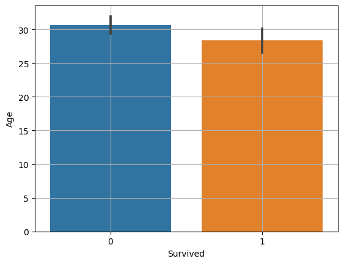

# 데이터 의미찾기 - 이변량분석 (범주->숫자)

### 1. 평균비교 barplot

1. barplot

두 집단 범주와 세 집단 이상의 범주 모두에 활용 가능

```python
sns.barplot(x="Survived", y="Age", data=titanic)
plt.grid()
plt.show()
```

* 각 그래프에 있는 검은색 선은 신뢰구간(오차범위)
    * 평균값이 얼마나 믿을만한가를 보여준다
    * 간격이 좁을수록 평균값의 신뢰도가 높아진다
    * 신뢰구간이 높아지려면 데이터가 많아지고, 편차가 적어야 한다
    * 바 그래프 사이에 신뢰구간이 서로 겹치면, 대립가설이 맞다고 주장하기 어렵다
* 두 평균의 차이가 크고, 신뢰구간이 겹치지 않을 때, 대립가설이 맞다고 볼 수 있다

### 2. t-test, t-통계량 ( 범주가 2개 )
* 두 평균의 차이 비교
* 두 평균 값을 뺀다(-) -> 따라서, 순서에 따라 값의 부호만 바뀌며, 절대값이 중요하다
* 데이터에 NaN이 있으면 계산이 안되기 때문에 .notnull() 등으로 NaN을 제외한 데이터를 사용
* t-통계량
    * 두 평균의 차이를 표준오차로 나눈 값
    * 보통 t 값이 -2보다 작거나, 2보다 크면 차이가 있으며, -2 혹은 2와 거리가 멀 수록 차이가 크다고 봄

1. t 통계량 구하기
 * 문법 : ttest_ind(B, A, equal_var = False)
    * equal_var : a와 b의 분산이 같은가? 모르면 False(기본값)

```python
# 먼저 NaN이 있는지 확인
titanic.isna().sum()
# NaN 행 제외
temp = titanic.loc[titanic['Age'].notnull()]
# 두 그룹으로 데이터 저장
died = temp.loc[temp['Survived']==0, 'Age']
survived = temp.loc[temp['Survived']==1, 'Age']
# died의 평균에서 survived의 평균을 뺌
spst.ttest_ind(died, survived)
```
    * Ttest_indResult(statistic=2.06668694625381, pvalue=0.03912465401348249)
* t통계량이 2를 넘기 때문에 차이가 있으나 크진 않다
* pvalu가 0.05보다 작기 때문에 차이가 있으나 크진 않다


### 3. 분산분석(ANOVA), f-통계량 ( 범주가 3개 이상)
* ANalysis Of VAriance
* 3개 이상의 여러 집단간에 차이 비교
* 전체 평균과 각 범주의 평균 비교
* 전체 평균대비 각 그룹간 차이가 있는지만 확인
    * 어느 그룹 간에 차이가 있는지는 알 수 없기 때문에, 분산분석 이후에 t-test로 사후 분석 진행
* f 통계량
    * (집단 간 분산)/(집단 내 분산) = (전체 평균 − 각 집단 평균)/(각 집단의 평균 − 개별 값)
    * 집단 간 분산 : 전체 평균과 각 집단 평균의 차이
    * 집단 내 분산 : A, B, C 각 집단 내의 평균과 개별 값들의 차이
    * 집단 간 분산은 클 수록 좋음, 집단 내 분산은 작을 수록 좋음
    * 값이 대략 2~3 이상이면 차이가 있다고 판단

1. f 통계량 구하기
* 문법 : f-oneway(A, B, C)
    * A, B, C 그룹을 직접 데이터로 지정해 주어야 함

```python
# NaN 행 제외
temp = titanic.loc[titanic['Age'].notnull()]
# 그룹별 저장
P_1 = temp.loc[temp.Pclass == 1, 'Age']
P_2 = temp.loc[temp.Pclass == 2, 'Age']
P_3 = temp.loc[temp.Pclass == 3, 'Age']
# anova
spst.f_oneway(P_1, P_2, P_3)
```
    * F_onewayResult(statistic=57.443484340676214, pvalue=7.487984171959904e-24)
* f-통계량이 57이기 때문에 범주에 따라 수치의 차이가 발생한다고 볼 수 있음
* pvalue가 0에 수렴하기 때문에(e-24) 서로 관계가 있다고 볼 수 있음