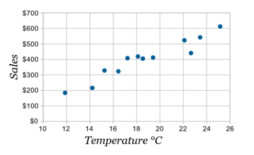
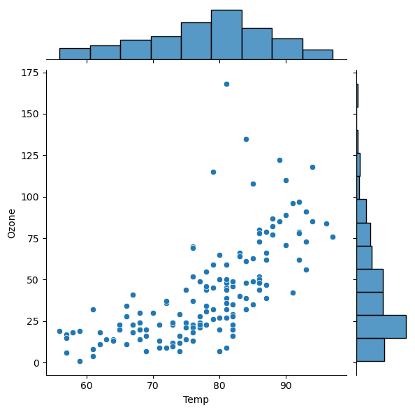
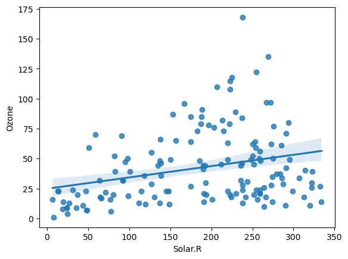
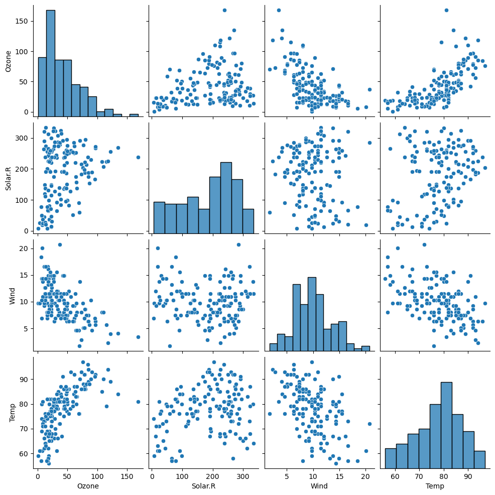

# 데이터 의미찾기 - 이변량분석 (숫자->숫자)

### 1. 산점도

1. 산점도

* 문법
    * plt.scatter( x축 값, y축 값 )
    * plt.scatter( ‘x변수’, ‘y변수’, data = dataframe이름) 
```python
plt.scatter(air['Temp'], air['Ozone'])
plt.show()
```
    * 이상치, 선형관계 여부, 양 혹은 음의 상관관계 등을 파악할 수 있음

* 두 변수의 관계
    * 산점도에서 또렷한 직선 패턴이 보이면, 강한 관계를 가짐
    * 수치로 변환하면, 1에 가까울수록 강한 관계를 가진다고 해석함

2.  다양한 산점도 그래프
* jointplot : 산점도와 각각의 히스토그램을 함께 보여준다
```python
sns.jointplot(x='Wind', y='Ozone', data = air)
plt.show()
```


* regplot : 산점도의 직선 관계를 직선으로 그려 나타낸다
    * 단, 직선 관계가 실제로 없어도 무조건 직선을 그리기 때문에, 유의해야 한다
```python
sns.regplot(x='Solar.R', y='Ozone', data = air)
plt.show()
```


* pairplot : 숫자형 변수들에 대한 산점도를 한꺼번에 그림
    * 시간이 많이 걸리기 때문에 사용하기 전에 변수를 정리하는 것이 필요
```python
sns.pairplot(air)
plt.show()
```


### 2. 상관계수, p-value

1. 상관계수 r

* 공분산을 표준화한 값
* -1 ~ 1 사이의 값이며, -1 혹은 1에 가까울수록 강한 상관관계를 나타냄
* 값에 NaN이 있으면 계산되지 않기 때문에 .notnull()로 NaN 제거 후 수행

2. 상관계수, pvalue 구하기

```python
import scipy.stats as spst

spst.pearsonr(air['Temp'], air['Ozone'])
```
* 결과 : PearsonRResult(statistic=0.6833717861490114, pvalue=2.197769800200274e-22)
    * 첫번째 상관계수, 두번째 pvalue
    * pvalue가 0에 수렴하기 때문에 상관관계가 존재하고, 상관계수가 0.68로 높은 편이기 때문에 강한 상관관계가 존재한다고 정리 가능

3. 모든 상관계수 구하기
```python
air.corr()
```
* 같은 변수끼리 구한 1 값은 의미 없음
* 1 값을 기준으로 대칭을 이루고 있기 때문에, 한쪽의 데이터만 봐도 충분함
* heatmap으로 데이터프레임의 모든 상관계수를 시각화 가능

4. 상관계수의 한계

* 상관계수는 직선의 관계(선형관계)만 수치화함
    * 직선의 기울기, 비선형 관계는 고려하지 않음
    * 직선의 기울기는 데이터에 따라 중요한 요소가 될 수 있음
    * *따라서 데이터를 분석할 때, 상관계수와 산점도 그래프를 같이 그릴 것*
