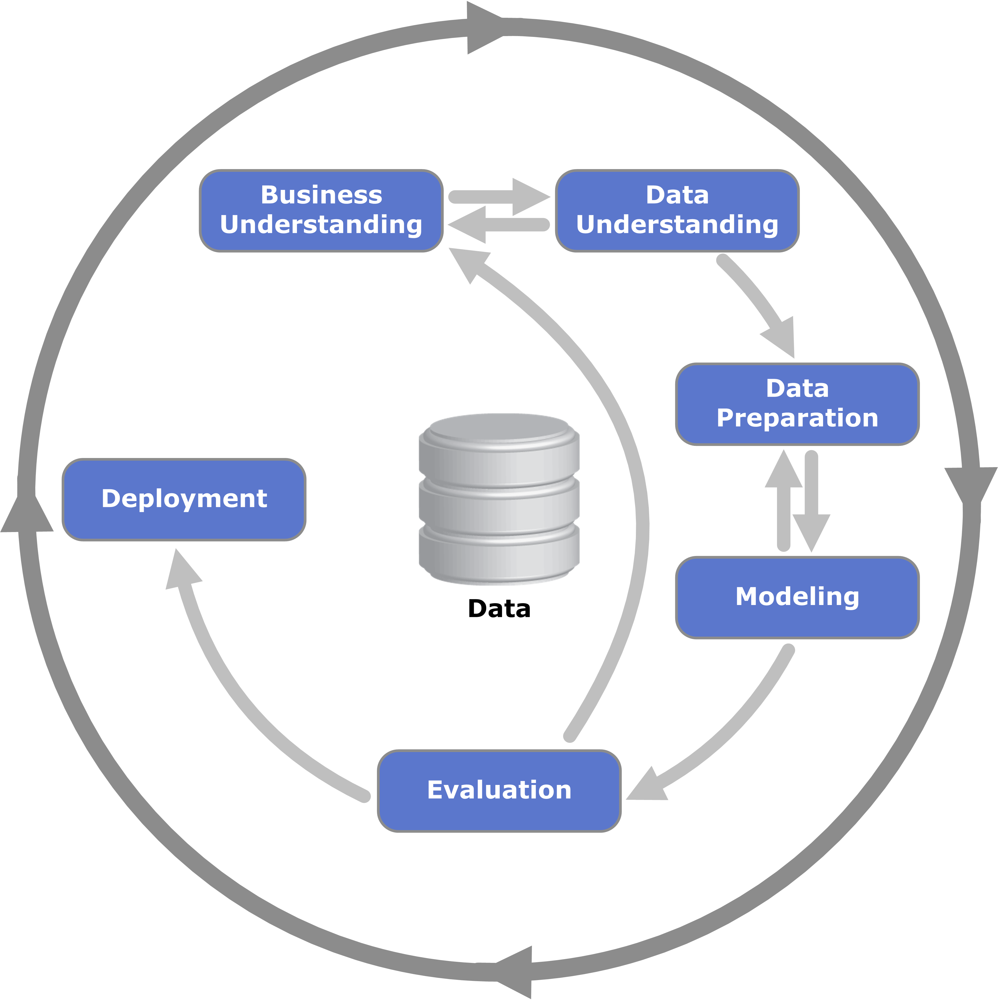

## **CRISP-DM(Cross-Industry Standard Process for Data Mining)**

* 전 세계에서 가장 많이 사용되는 데이터 마이닝 표준 방법론

* Business Understanding(비즈니스의 이해)  
   : ***무엇이 문제인가?***  
   : 문제 정의  
   : 데이터분석 방향, 목표 결정  
   : 초기 가설 수립 (x이면 y이다)  
   : 귀무 가설(기존에 내려오던 정설)과 대립가설(우리가 생각해낸 가설, 기존의 입장을 넘어서기 위한 새로운 가설)  
   : 가설 수립을 위해 해결해야 할 문제(목표, 관심사, y)를 찾고, y를 설명하기 위한 요인(x)를 찾은 후 가설의 구조를 정의해야 한다.(x->y)  

* Data Understanding(데이터 이해)  
   : 원본 식별 (x, y는 정보) - data 사전 생성  
   : 하나의 데이터프레임(, 데이터셋) 정리  
   : 있는 데이터, 없는 데이터로 분류 - 있는 데이터는 그대로 사용하거나 가공해서 사용하고, 없는 데이터는 취득 여부를 확인하고 취득하거나 최대한 쓸수 있도록 가용 데이터로 정리함
  > 2차원 데이터, x(feature, 행, 분석단위, 샘플, 관측치, 인스턴스, data point), y(target, label)로 구성  
  
   : 분석 - EDA & CDA(탐색적 데이터분석, 확증적 데이터분석)  

* Data Preparation(데이터 전처리)  
   : 모델링을 위한 데이터구조 만들기  
   : 모든 셀은 값이 있어야 한다. -> 결측치 조치  
   : 모든 값은 숫자여야 한다. -> 가변수화  
   : (필요에 따라) 값의 범위가 일치해야 한다. -> 스케일링  
   : -> 데이터 분할  

* Modeling(모델링)  
   : 중요 변수들을 선택하고, 적절한 알고리즘을 적용하여 예측 모델 생성 후 평가
   : 데이터로부터 패턴(오차를 최소화하는 패턴)을 찾는 과정  
   : 결과물 : 모델(***모델은 수학식***)  
   : 학습 데이터, 알고리즘 필요  

* Evaluation  
   : ***모델로 그 문제를 해결했는가?***  
   : 데이터 분석 목표 / 비스니스 목표 달성 평가  

* Delplyment(배포)  
   : 모델 및 배포가 고객 목표를 충족하는지 확인  
   

## 데이터구조(자료형)

 1. 범주형(질적 데이터, 정성적 데이터)
    * 명목형 데이터 : 성별, 시도, 흡연여부
    * 순서형 데이터 : 연령대, 매출등급

 2. 수치형(양적 데이터, 정량적 데이터)
    * 이산형 데이터 : 판매량, 매출액, 나이
    * 연속형 데이터 : 온도, 몸무게

 * 어떤 두 값을 곱했을 때 말이 성립하면 수치형, 그렇지 않다면 범주형
    * 3월은 1월의 3배인가?

## 분석할 수 있는 데이터

 * 기본 구조 : 2차원
    * 행 : 분석단위, 샘플, 관측치, 데이터 건수(Target, y, Output, Label, 종속변수)
    * 열 : 정보, 변수, 요인(Features, X, input, 독립변수)

 * NumPy, Pandas 등이 있음
    * NumPy : 수치 연산, Array 사용, 3차원, 4차원 등 다차원 연산 가능
    * Pandas : 비즈니스 데이터 표현
