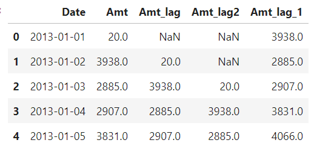

# 시계열 데이터

### 1. 시계열 데이터란
* 행과 행에 시간의 순서(흐름)가 있고
* 행과 행의 시간간격이 동일한 데이터

### 2. 날짜 요소 뽑기
* 날짜 타입의 변수로부터 날짜의 요소를 뽑아낼 수 있음

1. 날짜 요소로 변환
* pd.to_datetime(날짜데이터, format = '입력되는 날짜 형식')
    * data['Date'] = pd.to_datetime(data['Date'])
    * pd.to_datetime(data['Date'], format = '%d-%m-%Y')

2. .dt.날짜요소
| 메서드 |	내용 |
| ---- | ---- |
|"df['date'].dt.date" |	YYYY-MM-DD(문자) |
|"df['date'].dt.year" |	연(4자리 숫자) |
|"df['date'].dt.month" |	월(숫자) |
|"df['date'].dt.month_name" |	월(문자) |
|"df['date'].dt.day" |	일(숫자) |
|"df['date'].dt.time" |	HH:MM:SS(문자) |
|"df['date'].dt.hour" |	시(숫자) |
|"df['date'].dt.minute" |	분(숫자) |
|"df['date'].dt.second" |	초(숫자) |
|"df['date'].dt.quarter" |	분기(숫자) |
|"df['date'].dt.day_name" |	요일이름(문자) |
|"df['date'].dt.weekday" |	요일숫자(0-월, 1-화)(=dayofweek) |
|"df['date'].dt.weekofyear" |	연 기준 몇주째(숫자)(=week) |
|"df['date'].dt.dayofyear" |	연 기준 몇일째(숫자) |
|"df['date'].dt.days_in_month" |	월 일수(숫자)(=daysinmonth) |


### 3. 관련 메서드

1. shift
    * 시계열 데이터에서 시간의 흐름 전후로 정보를 이동시킬 때 사용
    * https://pandas.pydata.org/pandas-docs/stable/reference/api/pandas.DataFrame.shift.html
```python
# 전날 매출액 열 추가
temp['Amt_lag'] = temp['Amt'].shift() #default = 1 이전 값을 1칸 내려줘

# 전전날 매출액 열 추가
temp['Amt_lag2'] = temp['Amt'].shift(2) # 2행 shift 이전 값을 내려줘

# 다음날 매출액 열 추가
temp['Amt_lag_1'] = temp['Amt'].shift(-1) # 이전 값을 위로 끌어올려줘
```
    


2. rolling + 집계함수
    * 시간의 흐름에 따라 일정 기간 동안 평균을 이동하면서 구하기
    * .rolling : https://pandas.pydata.org/docs/reference/api/pandas.DataFrame.rolling.html
    * rolling(n)
        * n 기본값 : 1
        * min_periods : n 값을 설정한 상태에서, n 이하의 수라 해도 열에 값이 하나라도 있으면 그만큼이라도 집계하기(n=7일때, min_peroids가 1이면 1~6번째도 그 수만큼 집계하기)
```python
# 7일 이동평균 매출액
temp['Amt_MA7_1'] = temp['Amt'].rolling(7).mean()
temp['Amt_MA7_2'] = temp['Amt'].rolling(7, min_periods = 1).mean()
```

3. diff
    * 특정 시점 데이터, 이전 시점 데이터와의 차이 구하기
    * https://pandas.pydata.org/docs/reference/api/pandas.DataFrame.diff.html
```python
temp['Amt_D1'] = temp['Amt'].diff() # 인덱스 1-0, 인덱스 2-1, ...
temp['Amt_D2'] = temp['Amt'].diff(2) # 인덱스 2-0, 3-1, ...
```